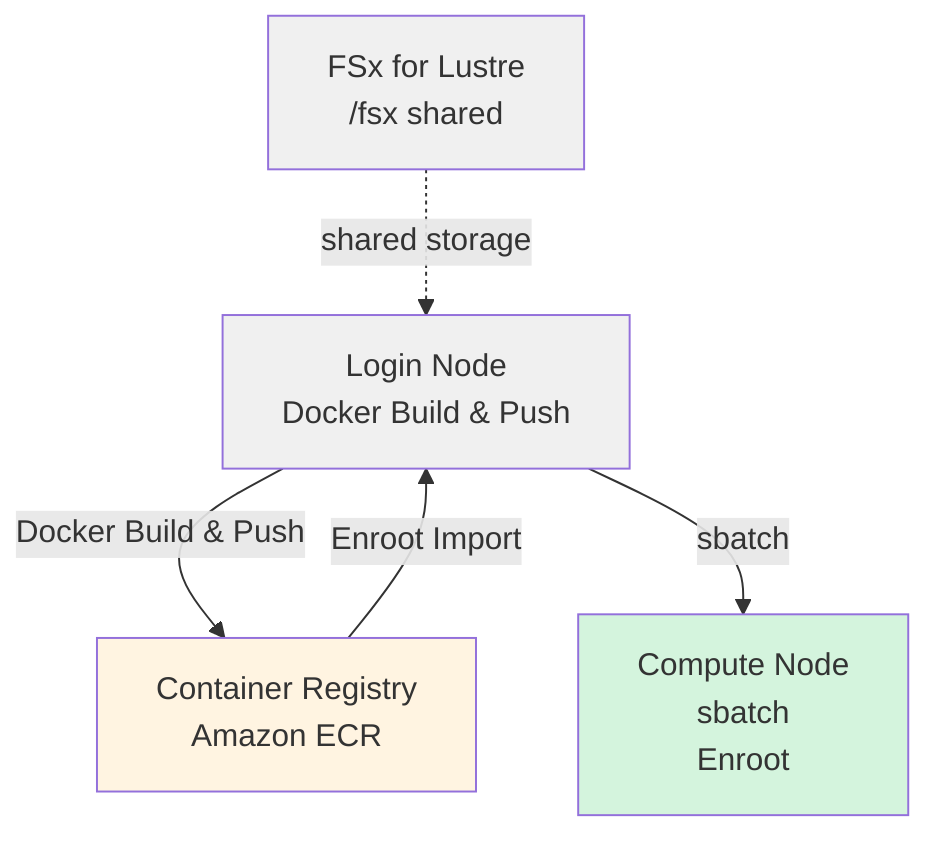

# NVIDIA Isaac GR00T Training Guide with HyperPod + Slurm + Enroot

A guide for running GR00T fine-tuning in Docker containers using Slurm + Enroot on AWS SageMaker HyperPod.

## Architecture



---

## Prerequisites

1. **HyperPod Cluster**: A HyperPod cluster built on AWS using the CDK included in this project
   - A manually created HyperPod cluster (e.g., via the console) can also be used for training
2. **Git LFS**: The Isaac GR00T repository uses Git LFS for sample data and other large files

---

## Steps

### Phase 1: Preparation on the HyperPod Login Node

#### 1.1 SSH into HyperPod

```bash
ssh pask-cluster
```

#### 1.2 Clone the PASK Repository

```bash
cd
git clone https://github.com/aws-samples/sample-physical-ai-scaffolding-kit.git
```

#### 1.2 Install Git LFS

The [Isaac GR00T](https://github.com/NVIDIA/Isaac-GR00T) repository uses Git LFS for large files such as sample data. Follow the [installation instructions](https://github.com/git-lfs/git-lfs/wiki/Installation) to install it.

If prompted with `Which services should be restarted?`, press the Tab key to select `<Ok>` and press Enter to continue.

```bash
curl -s https://packagecloud.io/install/repositories/github/git-lfs/script.deb.sh | sudo bash
sudo apt-get update
sudo apt-get install git-lfs
git lfs install
```

#### 1.3 Create the Log Output Directory

```bash
mkdir -p /fsx/ubuntu/joblog
```

#### 1.4 Clone the Isaac GR00T Repository

Clone the repository following the [**Installation Guide**](https://github.com/NVIDIA/Isaac-GR00T/tree/main?tab=readme-ov-file#installation-guide).

```bash
cd
git clone --recurse-submodules https://github.com/NVIDIA/Isaac-GR00T
export GR00T_HOME="$HOME/Isaac-GR00T"
```

---

### Phase 2: Build Docker Image & Push to ECR

#### 2.1 Build the Docker Image and Push to ECR

Build the Docker image on the login node and push it to ECR.

```bash
cd ~/sample-physical-ai-scaffolding-kit/samples/gr00t/training
sbatch slurm_build_docker.sh
```

**How Environment Information Is Retrieved (HyperPod Cluster)**:

The script retrieves environment information in the following priority order. When running inside HyperPod without any command-line arguments or environment variable settings, it retrieves information from EC2 instance metadata:

1. **Environment variables** (`AWS_REGION`, `AWS_ACCOUNT_ID`)
2. **Auto-detection**
   - **Region**: EC2 instance metadata (IMDSv2)
   - **Account ID**: AWS STS (`aws sts get-caller-identity`)
3. **Fallback**: Region defaults to `us-east-1`

**Available Environment Variables**:

| Variable | Default | Description |
|----------|---------|-------------|
| `GR00T_HOME` | (required) | Path to the Isaac-GR00T repository |
| `ECR_REPOSITORY` | `gr00t-train` | ECR repository name |
| `IMAGE_TAG` | `latest` | Docker image tag |
| `AWS_REGION` | Auto-detected | AWS region |
| `AWS_ACCOUNT_ID` | Auto-detected | AWS account ID |

```bash
# Example: Change the repository name and image tag
GR00T_HOME=$HOME/Isaac-GR00T ECR_REPOSITORY=my-gr00t IMAGE_TAG=v1.0.0 \
    sbatch slurm_build_docker.sh
```

**What It Does**:

- Creates the ECR repository `gr00t-train` (if it does not exist)
- Builds the Docker image (using the Isaac GR00T `docker/Dockerfile`)
- Pushes to ECR

**Checking Progress**:

```bash
# Check job status
squeue

# Find the job ID and set it as a variable
JOBID=<JOB_ID>

# View detailed status
sacct -j $JOBID

# Monitor logs in real time
tail -f /fsx/ubuntu/joblog/docker_build_$JOBID.out

# Check error logs
tail -f /fsx/ubuntu/joblog/docker_build_$JOBID.err
```

**Example Output**:

```bash
==================================================
Docker build and push completed successfully
End Time: Sat Mar 21 01:54:06 UTC 2026
==================================================
```

---

### Phase 3: Import the Enroot Container

#### 3.1 Convert the Docker Image to SquashFS Format

Convert the image built with Docker using Enroot. If a local Docker cache exists, it will be used; otherwise, the image will be pulled from ECR.

```bash
cd ~/sample-physical-ai-scaffolding-kit/samples/gr00t/training
bash ./hyperpod_import_container.sh
```

After completion, you can verify with the following commands.

```bash
export ENROOT_DATA_PATH=/fsx/enroot/data
enroot list
```

Examples of specifying arguments

```bash
# Specify the image tag
bash ./hyperpod_import_container.sh v1.0.0

# Specify the region
bash ./hyperpod_import_container.sh latest us-west-2

# Specify all parameters
bash ./hyperpod_import_container.sh latest us-west-2 123456789012
```

**How Environment Information Is Retrieved (HyperPod Cluster)**:

The script retrieves environment information in the following priority order:

1. **Command-line arguments** (highest priority)

   ```bash
   ./hyperpod_import_container.sh [IMAGE_TAG] [AWS_REGION] [AWS_ACCOUNT_ID]
   ```

2. **Environment variables**

   ```bash
   export AWS_REGION=us-west-2
   export AWS_ACCOUNT_ID=123456789012
   ./hyperpod_import_container.sh
   ```

3. **Auto-detection**
   - **Region**: EC2 instance metadata (IMDSv2)
   - **Account ID**: AWS STS (`aws sts get-caller-identity`)

4. **Fallback**: Region defaults to `us-east-1`

**Available Environment Variables**:

| Variable | Default | Description |
|----------|---------|-------------|
| `IMAGE_TAG` | `latest` | Docker image tag to import |
| `AWS_REGION` | Auto-detected | AWS region |
| `AWS_ACCOUNT_ID` | Auto-detected | AWS account ID |
| `ENROOT_CACHE_PATH` | `/fsx/enroot` | Enroot cache directory |
| `ENROOT_DATA_PATH` | `/fsx/enroot/data` | Enroot data directory (`.sqsh` output location) |

**What It Does**:

- Checks local Docker cache (pulls from ECR if not found)
- Converts to SquashFS format (`.sqsh`)
- Saves to `ENROOT_DATA_PATH`

---

### Phase 4: Run the Slurm Job

#### 4.1 Run Fine-Tuning

If you are using files uploaded to S3 as training data, change the permissions beforehand as shown below since write operations will occur, then run the training command.
If the sample data is located under `/fsx/ubuntu/` on Lustre, no permission changes are needed.

```bash
DATASET_PATH=/fsx/s3link/my_dataset
sudo chmod -R a+w "${DATASET_PATH}"
```

Training job parameters can be customized with environment variables.

```bash
# Example: Change the number of GPUs, steps, and dataset
NUM_GPUS=2 MAX_STEPS=5000 DATASET_PATH=/fsx/ubuntu/my_dataset \
    sbatch slurm_finetune_container.sh
```

**Available Environment Variables**:

| Variable | Default | Description |
|----------|---------|-------------|
| `NUM_GPUS` | `1` | Number of GPUs to use |
| `MAX_STEPS` | `2000` | Maximum number of training steps |
| `SAVE_STEPS` | `2000` | Checkpoint save interval |
| `GLOBAL_BATCH_SIZE` | `32` | Global batch size |
| `OUTPUT_DIR` | `/fsx/s3link/so100` | Checkpoint output directory |
| `DATASET_PATH` | `./demo_data/cube_to_bowl_5` | Training dataset path |
| `BASE_MODEL` | `nvidia/GR00T-N1.6-3B` | Base model |

Minimal command (all default values)

```bash
cd ~/sample-physical-ai-scaffolding-kit/samples/gr00t/training

export GR00T_HOME="$HOME/Isaac-GR00T"
sbatch slurm_finetune_container.sh
```

**Checking Progress**:

```bash
# Check job status
squeue

# Find the job ID and set it as a variable
JOBID=<JOB_ID>

# View detailed status
sacct -j $JOBID

# Monitor logs in real time
tail -f /fsx/ubuntu/joblog/finetune_$JOBID.out

# Check error logs
tail -f /fsx/ubuntu/joblog/finetune_$JOBID.err
```

---

## Slurm Job Management Commands

### Checking Jobs

```bash
# List your own jobs
squeue -u ubuntu

# Detailed information
squeue -u ubuntu -o "%.18i %.9P %.30j %.8u %.2t %.10M %.6D %R"

# All jobs (entire cluster)
squeue
```

### Canceling Jobs

```bash
# Cancel a specific job
scancel <JOB_ID>

# Cancel all your jobs
scancel -u ubuntu
```

---

## Reference Resources

### Documentation

- [NVIDIA Isaac GR00T](https://github.com/NVIDIA/Isaac-GR00T) - Official repository
- [AWS HyperPod Documentation](https://docs.aws.amazon.com/sagemaker/latest/dg/sagemaker-hyperpod.html)
- [Enroot Documentation](https://github.com/NVIDIA/enroot)
- [Slurm Documentation](https://slurm.schedmd.com/documentation.html)
