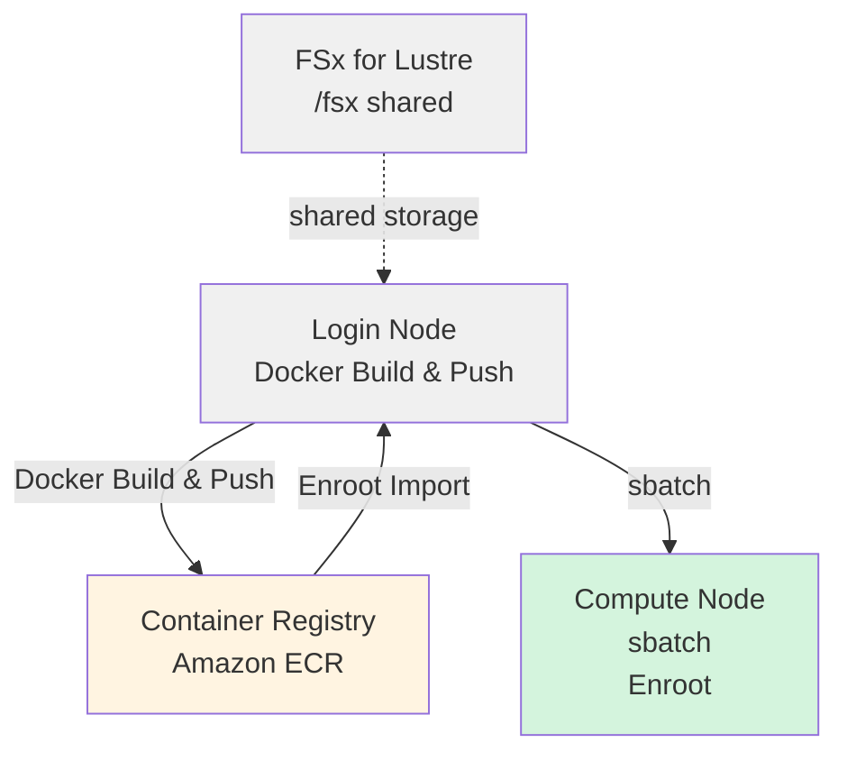

# NVIDIA Isaac GR00T Training Guide with HyperPod + Slurm + Enroot

AWS SageMaker HyperPod에서 Slurm + Enroot를 사용해 Docker container 안에서 GR00T fine-tuning을 실행하는 가이드입니다.

## Architecture



---

## Prerequisites

1. **HyperPod Cluster**: 이 project에 포함된 CDK로 AWS에 구축한 HyperPod cluster
   - Console 등으로 직접 생성한 HyperPod cluster도 training에 사용할 수 있습니다.
2. **Git LFS**: Isaac GR00T repository는 sample data와 large files에 Git LFS를 사용합니다.

---

## Steps

### Phase 1: HyperPod Login Node에서 준비

#### 1.1 HyperPod에 SSH 접속

```bash
ssh pask-cluster
```

#### 1.2 PASK Repository Clone

```bash
cd
git clone https://github.com/aws-samples/sample-physical-ai-scaffolding-kit.git
```

#### 1.2 Git LFS 설치

[Isaac GR00T](https://github.com/NVIDIA/Isaac-GR00T) repository는 sample data 같은 large files에 Git LFS를 사용합니다. [Installation instructions](https://github.com/git-lfs/git-lfs/wiki/Installation)를 따라 설치하세요.

`Which services should be restarted?` prompt가 표시되면 Tab key로 `<Ok>`를 선택하고 Enter를 눌러 계속합니다.

```bash
curl -s https://packagecloud.io/install/repositories/github/git-lfs/script.deb.sh | sudo bash
sudo apt-get update
sudo apt-get install git-lfs
git lfs install
```

#### 1.3 Log Output Directory 생성

```bash
mkdir -p /fsx/ubuntu/joblog
```

#### 1.4 Isaac GR00T Repository Clone

[**Installation Guide**](https://github.com/NVIDIA/Isaac-GR00T/tree/main?tab=readme-ov-file#installation-guide)에 따라 repository를 clone합니다.

```bash
cd
git clone --recurse-submodules https://github.com/NVIDIA/Isaac-GR00T
export GR00T_HOME="$HOME/Isaac-GR00T"
```

---

### Phase 2: Docker Image Build 및 ECR Push

#### 2.1 Docker Image Build 및 ECR Push

Login node에서 Docker image를 build하고 ECR에 push합니다.

```bash
cd ~/sample-physical-ai-scaffolding-kit/samples/gr00t/training
sbatch slurm_build_docker.sh
```

**Environment Information을 가져오는 방식 (HyperPod Cluster)**:

Script는 다음 priority로 environment information을 가져옵니다. HyperPod 안에서 command-line argument나 environment variable 설정 없이 실행하면 EC2 instance metadata에서 정보를 가져옵니다.

1. **Environment variables** (`AWS_REGION`, `AWS_ACCOUNT_ID`)
2. **Auto-detection**
   - **Region**: EC2 instance metadata (IMDSv2)
   - **Account ID**: AWS STS (`aws sts get-caller-identity`)
3. **Fallback**: Region default는 `us-east-1`

**Available Environment Variables**:

| Variable | Default | Description |
|----------|---------|-------------|
| `GR00T_HOME` | (required) | Isaac-GR00T repository path |
| `ECR_REPOSITORY` | `gr00t-train` | ECR repository name |
| `IMAGE_TAG` | `latest` | Docker image tag |
| `AWS_REGION` | Auto-detected | AWS region |
| `AWS_ACCOUNT_ID` | Auto-detected | AWS account ID |

```bash
# Example: repository name과 image tag 변경
GR00T_HOME=$HOME/Isaac-GR00T ECR_REPOSITORY=my-gr00t IMAGE_TAG=v1.0.0 \
    sbatch slurm_build_docker.sh
```

**What It Does**:

- ECR repository `gr00t-train`을 생성합니다. 이미 있으면 건너뜁니다.
- Docker image를 build합니다. Isaac GR00T의 `docker/Dockerfile`을 사용합니다.
- ECR에 push합니다.

**Checking Progress**:

```bash
# job status 확인
squeue

# job ID를 찾아 variable로 설정
JOBID=<JOB_ID>

# 상세 status 확인
sacct -j $JOBID

# log를 real time으로 monitor
tail -f /fsx/ubuntu/joblog/docker_build_$JOBID.out

# error log 확인
tail -f /fsx/ubuntu/joblog/docker_build_$JOBID.err
```

**Example Output**:

```bash
==================================================
Docker build and push completed successfully
End Time: Sat Mar 21 01:54:06 UTC 2026
==================================================
```

---

### Phase 3: Enroot Container Import

#### 3.1 Docker Image를 SquashFS Format으로 변환

Docker로 build한 image를 Enroot로 변환합니다. Local Docker cache가 있으면 사용하고, 없으면 ECR에서 image를 pull합니다.

```bash
cd ~/sample-physical-ai-scaffolding-kit/samples/gr00t/training
bash ./hyperpod_import_container.sh
```

완료 후 다음 command로 확인할 수 있습니다.

```bash
export ENROOT_DATA_PATH=/fsx/enroot/data
enroot list
```

Argument 지정 예시는 다음과 같습니다.

```bash
# image tag 지정
bash ./hyperpod_import_container.sh v1.0.0

# region 지정
bash ./hyperpod_import_container.sh latest us-west-2

# 모든 parameter 지정
bash ./hyperpod_import_container.sh latest us-west-2 123456789012
```

**Environment Information을 가져오는 방식 (HyperPod Cluster)**:

Script는 다음 priority로 environment information을 가져옵니다.

1. **Command-line arguments** (highest priority)

   ```bash
   ./hyperpod_import_container.sh [IMAGE_TAG] [AWS_REGION] [AWS_ACCOUNT_ID]
   ```

2. **Environment variables**

   ```bash
   export AWS_REGION=us-west-2
   export AWS_ACCOUNT_ID=123456789012
   ./hyperpod_import_container.sh
   ```

3. **Auto-detection**
   - **Region**: EC2 instance metadata (IMDSv2)
   - **Account ID**: AWS STS (`aws sts get-caller-identity`)

4. **Fallback**: Region default는 `us-east-1`

**Available Environment Variables**:

| Variable | Default | Description |
|----------|---------|-------------|
| `IMAGE_TAG` | `latest` | Import할 Docker image tag |
| `AWS_REGION` | Auto-detected | AWS region |
| `AWS_ACCOUNT_ID` | Auto-detected | AWS account ID |
| `ENROOT_CACHE_PATH` | `/fsx/enroot` | Enroot cache directory |
| `ENROOT_DATA_PATH` | `/fsx/enroot/data` | Enroot data directory (`.sqsh` output location) |

**What It Does**:

- Local Docker cache를 확인합니다. 없으면 ECR에서 pull합니다.
- SquashFS format (`.sqsh`)으로 변환합니다.
- `ENROOT_DATA_PATH`에 저장합니다.

---

### Phase 4: Slurm Job 실행

#### 4.1 Fine-Tuning 실행

S3에 upload한 file을 training data로 사용하는 경우 write operation이 발생하므로, 아래처럼 permission을 먼저 변경한 뒤 training command를 실행합니다.
Sample data가 Lustre의 `/fsx/ubuntu/` 아래에 있으면 permission 변경이 필요 없습니다.

```bash
DATASET_PATH=/fsx/s3link/my_dataset
sudo chmod -R a+w "${DATASET_PATH}"
```

Training job parameter는 environment variables로 customize할 수 있습니다.

```bash
# Example: GPU 수, step 수, dataset 변경
NUM_GPUS=2 MAX_STEPS=5000 DATASET_PATH=/fsx/ubuntu/my_dataset \
    sbatch slurm_finetune_container.sh
```

**Available Environment Variables**:

| Variable | Default | Description |
|----------|---------|-------------|
| `NUM_GPUS` | `1` | 사용할 GPU 수 |
| `MAX_STEPS` | `2000` | Maximum training steps |
| `SAVE_STEPS` | `2000` | Checkpoint save interval |
| `GLOBAL_BATCH_SIZE` | `32` | Global batch size |
| `OUTPUT_DIR` | `/fsx/s3link/so100` | Checkpoint output directory |
| `DATASET_PATH` | `./demo_data/cube_to_bowl_5` | Training dataset path |
| `BASE_MODEL` | `nvidia/GR00T-N1.6-3B` | Base model |

Minimal command입니다. 모든 default value를 사용합니다.

```bash
cd ~/sample-physical-ai-scaffolding-kit/samples/gr00t/training

export GR00T_HOME="$HOME/Isaac-GR00T"
sbatch slurm_finetune_container.sh
```

**Checking Progress**:

```bash
# job status 확인
squeue

# job ID를 찾아 variable로 설정
JOBID=<JOB_ID>

# 상세 status 확인
sacct -j $JOBID

# log를 real time으로 monitor
tail -f /fsx/ubuntu/joblog/finetune_$JOBID.out

# error log 확인
tail -f /fsx/ubuntu/joblog/finetune_$JOBID.err
```

---

## Slurm Job Management Commands

### Checking Jobs

```bash
# 본인 job 목록
squeue -u ubuntu

# 상세 정보
squeue -u ubuntu -o "%.18i %.9P %.30j %.8u %.2t %.10M %.6D %R"

# 모든 job (entire cluster)
squeue
```

### Canceling Jobs

```bash
# 특정 job cancel
scancel <JOB_ID>

# 본인 job 전체 cancel
scancel -u ubuntu
```

---

## Reference Resources

### Documentation

- [NVIDIA Isaac GR00T](https://github.com/NVIDIA/Isaac-GR00T) - Official repository
- [AWS HyperPod Documentation](https://docs.aws.amazon.com/sagemaker/latest/dg/sagemaker-hyperpod.html)
- [Enroot Documentation](https://github.com/NVIDIA/enroot)
- [Slurm Documentation](https://slurm.schedmd.com/documentation.html)
