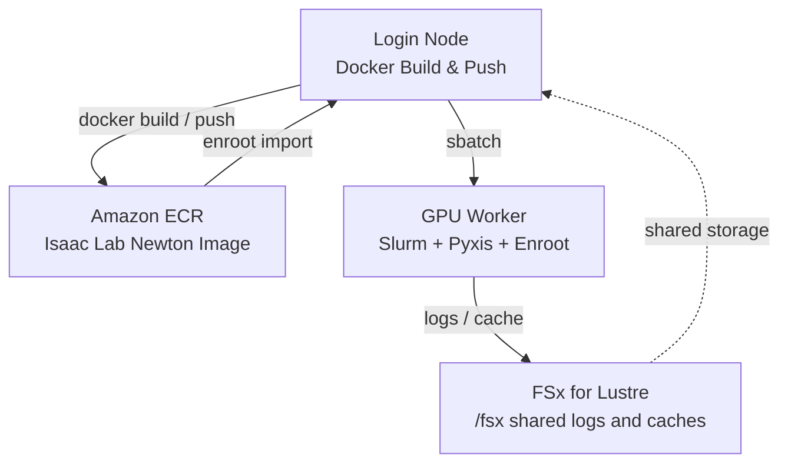

# Isaac Lab Newton RSL-RL Training Guide with HyperPod + Slurm + Enroot

This guide shows how to run reinforcement learning training on Amazon SageMaker HyperPod with NVIDIA Isaac Lab, the Newton physics backend, and RSL-RL.

The default workload trains an ANYmal-D locomotion policy on `Isaac-Velocity-Flat-Anymal-D-v0` with `presets=newton`, following the Isaac Lab RSL-RL Newton workflow.

References:

- [NVIDIA blog: Train a quadruped locomotion policy and simulate cloth manipulation with Isaac Lab and Newton](https://developer.nvidia.com/blog/train-a-quadruped-locomotion-policy-and-simulate-cloth-manipulation-with-nvidia-isaac-lab-and-newton/)
- [Isaac Lab RSL-RL training scripts](https://isaac-sim.github.io/IsaacLab/develop/source/overview/reinforcement-learning/rl_existing_scripts.html)
- [Isaac Lab Docker guide](https://isaac-sim.github.io/IsaacLab/develop/source/deployment/docker.html)
- [Related upstream feature request](https://github.com/aws-samples/sample-physical-ai-scaffolding-kit/issues/10)

## Architecture



## Prerequisites

1. A SageMaker HyperPod Slurm cluster built with the CDK in this repository.
2. One GPU worker group. For smoke tests, `ml.g6e.2xlarge` is a practical starting point.
3. Docker, Enroot, Pyxis, AWS CLI, and ECR permissions on the HyperPod nodes.
4. Acceptance of the NVIDIA Isaac Lab container license terms. The scripts require `ACCEPT_EULA=Y` explicitly.

The sample is based on the pinned container `nvcr.io/nvidia/isaac-lab:3.0.0-beta1`.

## Steps

### 1. Prepare Directories

SSH into the HyperPod login node and create the shared log directory before submitting Slurm jobs. Slurm opens the output path before the script starts.

```bash
ssh pask-cluster
mkdir -p /fsx/ubuntu/isaac-lab-newton/logs
```

Clone this repository if it is not already present.

```bash
cd
git clone https://github.com/aws-samples/sample-physical-ai-scaffolding-kit.git
```

### 2. Build and Push the Container

```bash
cd ~/sample-physical-ai-scaffolding-kit/samples/isaac-lab-newton/training
ACCEPT_EULA=Y PRIVACY_CONSENT=Y sbatch slurm_build_docker.sh
```

Environment variables:

| Variable | Default | Description |
|----------|---------|-------------|
| `ACCEPT_EULA` | required | Must be `Y` to acknowledge the NVIDIA Isaac Lab container license terms |
| `PRIVACY_CONSENT` | `Y` | NVIDIA privacy consent flag passed during build/run |
| `ECR_REPOSITORY` | `isaac-lab-newton` | ECR repository name |
| `IMAGE_TAG` | `3.0.0-beta1` | Docker image tag |
| `BASE_IMAGE` | `nvcr.io/nvidia/isaac-lab:3.0.0-beta1` | Pinned Isaac Lab base image |
| `AWS_REGION` | auto-detected | AWS region |
| `AWS_ACCOUNT_ID` | auto-detected | AWS account ID |

Monitor the build:

```bash
squeue
tail -f /fsx/ubuntu/isaac-lab-newton/logs/docker_build_<JOB_ID>.out
```

### 3. Import the Image to Enroot

Run this on the login node after the Docker image has been pushed to ECR.

```bash
cd ~/sample-physical-ai-scaffolding-kit/samples/isaac-lab-newton/training
bash ./hyperpod_import_container.sh
```

Optional arguments:

```bash
bash ./hyperpod_import_container.sh 3.0.0-beta1 us-west-2 123456789012
```

The default Enroot output is:

```text
/fsx/enroot/data/isaac-lab-newton+3.0.0-beta1.sqsh
```

### 4. Run RSL-RL Training with Newton

Smoke test:

```bash
ACCEPT_EULA=Y PRIVACY_CONSENT=Y NUM_ENVS=128 MAX_ITERATIONS=2 \
    sbatch slurm_train_rsl_rl.sh
```

Longer default run:

```bash
ACCEPT_EULA=Y PRIVACY_CONSENT=Y sbatch slurm_train_rsl_rl.sh
```

Training variables:

| Variable | Default | Description |
|----------|---------|-------------|
| `TASK` | `Isaac-Velocity-Flat-Anymal-D-v0` | Isaac Lab task name |
| `NUM_ENVS` | `4096` | Parallel environments |
| `MAX_ITERATIONS` | `100` | RSL-RL training iterations |
| `EXPERIMENT_NAME` | `anymal_d_newton` | RSL-RL experiment directory |
| `RUN_NAME` | `run_<SLURM_JOB_ID>` | Run directory suffix |
| `CONTAINER_IMAGE` | `/fsx/enroot/data/isaac-lab-newton+3.0.0-beta1.sqsh` | Enroot image path |
| `ISAAC_NEWTON_BASE_DIR` | `/fsx/ubuntu/isaac-lab-newton` | Shared log/cache base directory |

The job runs:

```bash
./isaaclab.sh -p scripts/reinforcement_learning/rsl_rl/train.py \
    --task Isaac-Velocity-Flat-Anymal-D-v0 \
    --num_envs 4096 \
    --max_iterations 100 \
    --headless \
    --logger tensorboard \
    presets=newton
```

Logs and RSL-RL artifacts are written under:

```text
/fsx/ubuntu/isaac-lab-newton/logs/
```

## Verification

For a smoke test, success means:

1. The Slurm job exits with status `COMPLETED`.
2. The log contains the `presets=newton` training command.
3. Isaac Lab creates RSL-RL run artifacts under `/fsx/ubuntu/isaac-lab-newton/logs/isaaclab/rsl_rl/`.

Useful commands:

```bash
sacct -j <JOB_ID>
tail -f /fsx/ubuntu/isaac-lab-newton/logs/train_<JOB_ID>.out
find /fsx/ubuntu/isaac-lab-newton/logs/isaaclab -maxdepth 4 -type f | head
```
