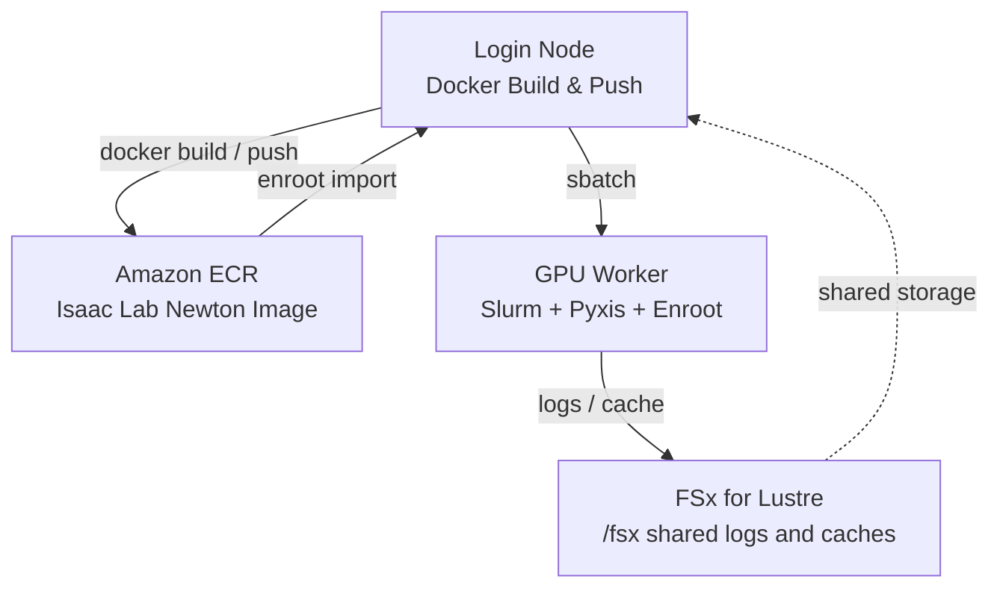

# HyperPod + Slurm + Enroot を使った Isaac Lab Newton RSL-RL トレーニングガイド

このガイドでは、Amazon SageMaker HyperPod 上で NVIDIA Isaac Lab、Newton 物理バックエンド、RSL-RL を使った強化学習トレーニングを実行します。

デフォルトのワークロードは、Isaac Lab の RSL-RL Newton ワークフローに従い、`presets=newton` を指定して `Isaac-Velocity-Flat-Anymal-D-v0` の ANYmal-D 歩行ポリシーを学習します。

参考リンク:

- [NVIDIA blog: Train a quadruped locomotion policy and simulate cloth manipulation with Isaac Lab and Newton](https://developer.nvidia.com/blog/train-a-quadruped-locomotion-policy-and-simulate-cloth-manipulation-with-nvidia-isaac-lab-and-newton/)
- [Isaac Lab RSL-RL training scripts](https://isaac-sim.github.io/IsaacLab/develop/source/overview/reinforcement-learning/rl_existing_scripts.html)
- [Isaac Lab Docker guide](https://isaac-sim.github.io/IsaacLab/develop/source/deployment/docker.html)
- [関連する upstream feature request](https://github.com/aws-samples/sample-physical-ai-scaffolding-kit/issues/10)

## アーキテクチャ



## 前提条件

1. 本リポジトリの CDK で構築された SageMaker HyperPod Slurm クラスター。
2. GPU ワーカーグループ。スモークテストでは `ml.g6e.2xlarge` が実用的な開始点です。
3. HyperPod ノード上で Docker、Enroot、Pyxis、AWS CLI、ECR 権限が利用できること。
4. NVIDIA Isaac Lab コンテナのライセンス条件に同意していること。スクリプトでは `ACCEPT_EULA=Y` を明示的に要求します。

このサンプルは、固定されたコンテナ `nvcr.io/nvidia/isaac-lab:3.0.0-beta1` をベースにしています。

## 手順

### 1. ディレクトリ準備

HyperPod のログインノードに SSH し、Slurm ジョブを投入する前に共有ログディレクトリを作成します。Slurm はスクリプト開始前に出力先を開きます。

```bash
ssh pask-cluster
mkdir -p /fsx/ubuntu/isaac-lab-newton/logs
```

リポジトリがまだない場合は clone します。

```bash
cd
git clone https://github.com/aws-samples/sample-physical-ai-scaffolding-kit.git
```

### 2. コンテナのビルドと ECR への push

```bash
cd ~/sample-physical-ai-scaffolding-kit/samples/isaac-lab-newton/training
ACCEPT_EULA=Y PRIVACY_CONSENT=Y sbatch slurm_build_docker.sh
```

環境変数:

| Variable | Default | Description |
|----------|---------|-------------|
| `ACCEPT_EULA` | required | NVIDIA Isaac Lab コンテナのライセンス条件への同意として `Y` が必要 |
| `PRIVACY_CONSENT` | `Y` | ビルド/実行時に渡す NVIDIA privacy consent フラグ |
| `ECR_REPOSITORY` | `isaac-lab-newton` | ECR リポジトリ名 |
| `IMAGE_TAG` | `3.0.0-beta1` | Docker イメージタグ |
| `BASE_IMAGE` | `nvcr.io/nvidia/isaac-lab:3.0.0-beta1` | 固定された Isaac Lab ベースイメージ |
| `AWS_REGION` | auto-detected | AWS リージョン |
| `AWS_ACCOUNT_ID` | auto-detected | AWS アカウント ID |

ビルドの確認:

```bash
squeue
tail -f /fsx/ubuntu/isaac-lab-newton/logs/docker_build_<JOB_ID>.out
```

### 3. Enroot へのイメージ import

Docker イメージを ECR に push した後、ログインノードで実行します。

```bash
cd ~/sample-physical-ai-scaffolding-kit/samples/isaac-lab-newton/training
bash ./hyperpod_import_container.sh
```

引数指定の例:

```bash
bash ./hyperpod_import_container.sh 3.0.0-beta1 us-west-2 123456789012
```

デフォルトの Enroot 出力先:

```text
/fsx/enroot/data/isaac-lab-newton+3.0.0-beta1.sqsh
```

### 4. Newton を使った RSL-RL トレーニング

スモークテスト:

```bash
ACCEPT_EULA=Y PRIVACY_CONSENT=Y NUM_ENVS=128 MAX_ITERATIONS=2 \
    sbatch slurm_train_rsl_rl.sh
```

デフォルト設定での実行:

```bash
ACCEPT_EULA=Y PRIVACY_CONSENT=Y sbatch slurm_train_rsl_rl.sh
```

トレーニング変数:

| Variable | Default | Description |
|----------|---------|-------------|
| `TASK` | `Isaac-Velocity-Flat-Anymal-D-v0` | Isaac Lab のタスク名 |
| `NUM_ENVS` | `4096` | 並列環境数 |
| `MAX_ITERATIONS` | `100` | RSL-RL の学習 iteration 数 |
| `EXPERIMENT_NAME` | `anymal_d_newton` | RSL-RL の experiment ディレクトリ |
| `RUN_NAME` | `run_<SLURM_JOB_ID>` | run ディレクトリの suffix |
| `CONTAINER_IMAGE` | `/fsx/enroot/data/isaac-lab-newton+3.0.0-beta1.sqsh` | Enroot イメージパス |
| `ISAAC_NEWTON_BASE_DIR` | `/fsx/ubuntu/isaac-lab-newton` | 共有ログ/キャッシュのベースディレクトリ |

ジョブ内では以下を実行します。

```bash
./isaaclab.sh -p scripts/reinforcement_learning/rsl_rl/train.py \
    --task Isaac-Velocity-Flat-Anymal-D-v0 \
    --num_envs 4096 \
    --max_iterations 100 \
    --headless \
    --logger tensorboard \
    presets=newton
```

ログと RSL-RL artifact は以下に保存されます。

```text
/fsx/ubuntu/isaac-lab-newton/logs/
```

## 検証

スモークテストでは以下を成功条件とします。

1. Slurm ジョブのステータスが `COMPLETED` になること。
2. ログに `presets=newton` を含むトレーニングコマンドが出力されること。
3. `/fsx/ubuntu/isaac-lab-newton/logs/isaaclab/rsl_rl/` に Isaac Lab の RSL-RL artifact が作成されること。

確認コマンド:

```bash
sacct -j <JOB_ID>
tail -f /fsx/ubuntu/isaac-lab-newton/logs/train_<JOB_ID>.out
find /fsx/ubuntu/isaac-lab-newton/logs/isaaclab -maxdepth 4 -type f | head
```
