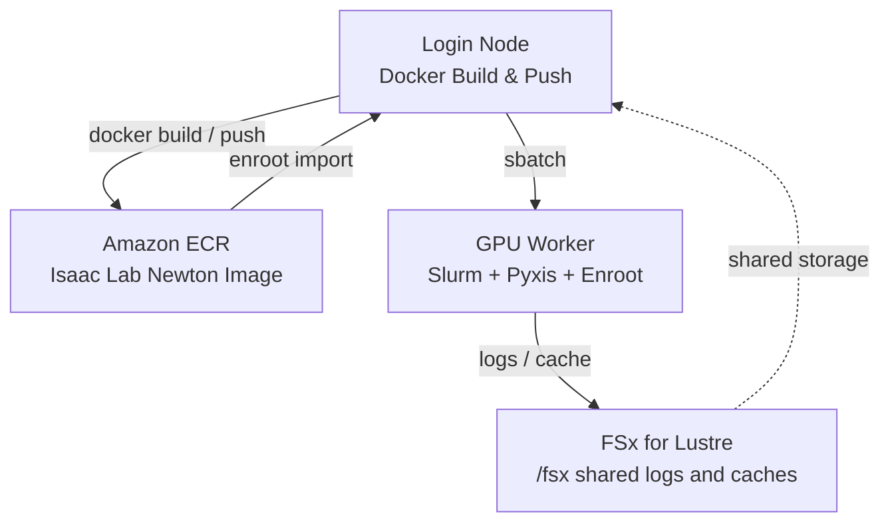

# HyperPod + Slurm + Enroot에서 Isaac Lab Newton RSL-RL Training 실행

이 문서는 Amazon SageMaker HyperPod에서 NVIDIA Isaac Lab, Newton physics backend, RSL-RL을 사용해 RL training을 실행하는 절차를 설명합니다.

기본 workload는 Isaac Lab RSL-RL Newton workflow를 따라 `presets=newton`으로 `Isaac-Velocity-Flat-Anymal-D-v0` task의 ANYmal-D locomotion policy를 학습합니다.

참고 자료:

- [NVIDIA blog: Train a quadruped locomotion policy and simulate cloth manipulation with Isaac Lab and Newton](https://developer.nvidia.com/blog/train-a-quadruped-locomotion-policy-and-simulate-cloth-manipulation-with-nvidia-isaac-lab-and-newton/)
- [Isaac Lab RSL-RL training scripts](https://isaac-sim.github.io/IsaacLab/develop/source/overview/reinforcement-learning/rl_existing_scripts.html)
- [Isaac Lab Docker guide](https://isaac-sim.github.io/IsaacLab/develop/source/deployment/docker.html)
- [Related upstream feature request](https://github.com/aws-samples/sample-physical-ai-scaffolding-kit/issues/10)

## 구성



## 사전 준비

1. 이 리포지터리의 CDK로 생성한 SageMaker HyperPod Slurm 클러스터가 필요합니다.
2. GPU worker group이 하나 이상 필요합니다. Smoke test에는 `ml.g6e.2xlarge`를 시작점으로 사용할 수 있습니다.
3. HyperPod node에서 Docker, Enroot, Pyxis, AWS CLI, ECR 권한을 사용할 수 있어야 합니다.
4. NVIDIA Isaac Lab container license 조건에 동의해야 합니다. 스크립트는 `ACCEPT_EULA=Y`를 명시적으로 요구합니다.

이 샘플은 `nvcr.io/nvidia/isaac-lab:3.0.0-beta1` container를 고정해서 사용합니다.

## 실행 절차

### 1. 디렉터리 준비

HyperPod login node에 SSH로 접속한 뒤, Slurm job을 제출하기 전에 shared log directory를 만듭니다. Slurm은 script 실행 전에 output path를 먼저 엽니다.

```bash
ssh pask-cluster
mkdir -p /fsx/ubuntu/isaac-lab-newton/logs
```

리포지터리가 아직 없다면 clone합니다.

```bash
cd
git clone https://github.com/aws-samples/sample-physical-ai-scaffolding-kit.git
```

### 2. Container build 및 ECR push

```bash
cd ~/sample-physical-ai-scaffolding-kit/samples/newton-rl/training
ACCEPT_EULA=Y PRIVACY_CONSENT=Y sbatch slurm_build_docker.sh
```

환경 변수:

| 변수 | 기본값 | 설명 |
|----------|---------|-------------|
| `ACCEPT_EULA` | required | NVIDIA Isaac Lab container license 조건 동의를 위해 `Y`로 설정해야 합니다 |
| `PRIVACY_CONSENT` | `Y` | build/run 시 전달되는 NVIDIA privacy consent flag |
| `ECR_REPOSITORY` | `isaac-lab-newton` | ECR repository 이름 |
| `IMAGE_TAG` | `3.0.0-beta1` | Docker image tag |
| `BASE_IMAGE` | `nvcr.io/nvidia/isaac-lab:3.0.0-beta1` | 고정된 Isaac Lab base image |
| `AWS_REGION` | auto-detected | AWS region |
| `AWS_ACCOUNT_ID` | auto-detected | AWS account ID |

빌드 상태 확인:

```bash
squeue
tail -f /fsx/ubuntu/isaac-lab-newton/logs/docker_build_<JOB_ID>.out
```

### 3. Enroot image import

Docker image를 ECR에 push한 뒤 login node에서 실행합니다.

```bash
cd ~/sample-physical-ai-scaffolding-kit/samples/newton-rl/training
bash ./hyperpod_import_container.sh
```

필요하면 tag, region, account ID를 인자로 넘길 수 있습니다.

```bash
bash ./hyperpod_import_container.sh 3.0.0-beta1 us-west-2 123456789012
```

기본 Enroot output path는 다음과 같습니다.

```text
/fsx/enroot/data/isaac-lab-newton+3.0.0-beta1.sqsh
```

### 4. Newton으로 RSL-RL training 실행

Smoke test:

```bash
ACCEPT_EULA=Y PRIVACY_CONSENT=Y NUM_ENVS=128 MAX_ITERATIONS=2 \
    sbatch slurm_train_rsl_rl.sh
```

기본 training run:

```bash
ACCEPT_EULA=Y PRIVACY_CONSENT=Y sbatch slurm_train_rsl_rl.sh
```

Training environment variables:

| 변수 | 기본값 | 설명 |
|----------|---------|-------------|
| `TASK` | `Isaac-Velocity-Flat-Anymal-D-v0` | Isaac Lab task name |
| `NUM_ENVS` | `4096` | 병렬 environment 수 |
| `MAX_ITERATIONS` | `100` | RSL-RL training iteration 수 |
| `EXPERIMENT_NAME` | `anymal_d_newton` | RSL-RL experiment directory |
| `RUN_NAME` | `run_<SLURM_JOB_ID>` | Run directory suffix |
| `CONTAINER_IMAGE` | `/fsx/enroot/data/isaac-lab-newton+3.0.0-beta1.sqsh` | Enroot image path |
| `ISAAC_NEWTON_BASE_DIR` | `/fsx/ubuntu/isaac-lab-newton` | Shared log/cache base directory |

Job은 내부에서 다음 명령을 실행합니다.

```bash
./isaaclab.sh -p scripts/reinforcement_learning/rsl_rl/train.py \
    --task Isaac-Velocity-Flat-Anymal-D-v0 \
    --num_envs 4096 \
    --max_iterations 100 \
    --headless \
    --logger tensorboard \
    presets=newton
```

로그와 RSL-RL artifact는 다음 path 아래에 저장됩니다.

```text
/fsx/ubuntu/isaac-lab-newton/logs/
```

## 검증

Smoke test 성공 기준:

1. Slurm job이 `COMPLETED` 상태로 종료됩니다.
2. 로그에 `presets=newton` training command가 포함됩니다.
3. Isaac Lab이 `/fsx/ubuntu/isaac-lab-newton/logs/isaaclab/rsl_rl/` 아래에 RSL-RL run artifact를 생성합니다.

유용한 확인 명령:

```bash
sacct -j <JOB_ID>
tail -f /fsx/ubuntu/isaac-lab-newton/logs/train_<JOB_ID>.out
find /fsx/ubuntu/isaac-lab-newton/logs/isaaclab -maxdepth 4 -type f | head
```
