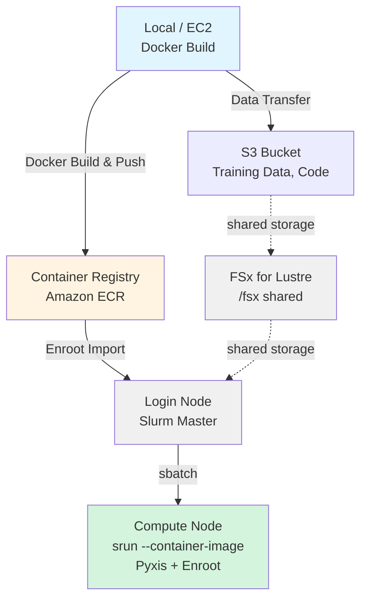

# OpenPI LoRA Training Guide with HyperPod + Slurm + Enroot

A guide for running LoRA fine-tuning in Docker containers using Slurm + Enroot on AWS SageMaker HyperPod.

## Architecture



***

## Prerequisites

1. **HyperPod Cluster**: A HyperPod cluster built on AWS using the CDK included in this project.
	The steps below assume a HyperPod cluster deployed via CDK, but clusters created manually through the console can also be used for training.
2. **Development Environment**: The following setup is required:
	1. AWS credentials configuration: For ECR access
	2. Docker: For building the pi0 training image
3. **Hugging Face Token**: For downloading sample training datasets (`HF_TOKEN`)
	1. You need to sign up at [Hugging Face](https://huggingface.co/settings/tokens) and generate a token in advance. This is not required if you use your own training data.

***

## Execution Steps

### Building the Image Locally & Pushing to ECR

#### Building the Docker Image and Pushing to ECR

```bash
cd samples/openpi-sample/

# Clone openpi
git clone https://github.com/Physical-Intelligence/openpi.git

cd lora_training/

# Build & push to ECR (uses the AWS CLI default region)
./build_and_push_ecr.sh

# To specify both region and account ID
./build_and_push_ecr.sh us-west-2 123456789012

# To specify a specific tag
IMAGE_TAG=v1.0.0 ./build_and_push_ecr.sh
```

**How Environment Information Is Retrieved (Local PC)**:

The script retrieves environment information in the following priority order:

1. **Command-line arguments** (highest priority)
2. **Environment variables** (`AWS_REGION`, `AWS_ACCOUNT_ID`)
3. **AWS CLI configuration**
   * Region: `aws configure get region`
   * Account ID: `aws sts get-caller-identity --query Account --output text`

**What the script does**:
* Creates the ECR repository `openpi-lora-train` (if it does not exist)
* Builds the Docker image (using `train_lora.Dockerfile`)
* Pushes to ECR

**Example output**:

```
✅ Docker image successfully pushed to ECR
Image URI: 123456789012.dkr.ecr.us-west-2.amazonaws.com/openpi-lora-train:latest
```

***

### Preparation on the HyperPod Login Node

#### SSH Connection to HyperPod

Connect by following the SSH connection instructions in [DEPLOYMENT.md](../../../hyperpod/docs/en/DEPLOYMENT.md).
```
ssh pask-cluster
```

#### Project Setup

```bash
# Clone the PASK repository
cd
git clone https://github.com/aws-samples/sample-physical-ai-scaffolding-kit.git

# Run setup. See below for parameters
cd samples/openpi-sample/lora_training
./setup.sh --hf-token "hf_xxxxx"

# Apply environment variables
source ~/.bashrc
```

**Parameters**
* hf-token (optional): Specify a Hugging Face token starting with "hf\_"
	* You need to sign up at [Hugging Face](https://huggingface.co/settings/tokens) and generate a token in advance.

**What the script does**

1. Clones the OpenPI repository
	- If /fsx/ubuntu/samples/openpi-sample/openpi/ does not exist
	- Runs git clone <https://github.com/Physical-Intelligence/openpi.git> from GitHub
2. Creates directory structure
	- /fsx/ubuntu/samples/openpi-sample/logs/
	- /fsx/ubuntu/samples/openpi-sample/.cache/
	- /fsx/ubuntu/samples/openpi-sample/openpi/assets/physical-intelligence/libero/
3. Sets environment variables in \~/.bashrc
	- Removes existing OpenPI/Enroot settings if present (creates a backup)
	- Appends the following environment variables: These environment variables are used in all Slurm job scripts.
		* export OPENPI\_BASE\_DIR=/fsx/ubuntu/samples/openpi-sample
		* export OPENPI\_PROJECT\_ROOT=\${OPENPI\_BASE\_DIR}/openpi
		* export OPENPI\_DATA\_HOME=\${OPENPI\_BASE\_DIR}/.cache
		* export OPENPI\_LOG\_DIR=\${OPENPI\_BASE\_DIR}/logs
		* export HF\_TOKEN=<value specified as argument or empty>
		* export ENROOT\_CACHE\_PATH=/fsx/enroot
		* export ENROOT\_DATA\_PATH=/fsx/enroot/data

**About Weights & Biases (wandb)**:
* The default scripts disable wandb (`--no-wandb-enabled`)
* If you want to track training with wandb:
  1. Create an account at [wandb.ai](https://wandb.ai)
  2. Get your API key and add it to `~/.bashrc`: `export WANDB_API_KEY=your_key_here`
  3. Remove `--no-wandb-enabled` from the script (or change it to `--wandb-enabled`)

---
#### Importing the Docker Image with Enroot

```bash
# Convert ECR image to Enroot format
cd samples/openpi-sample/lora_training

# Auto-detect from EC2 metadata
./hyperpod_import_container.sh

# Specify an image tag
./hyperpod_import_container.sh v1.0.0

# Specify a region
./hyperpod_import_container.sh latest us-west-2
```

**How Environment Information Is Retrieved (HyperPod Cluster)**:

The script retrieves environment information in the following priority order. When running inside HyperPod without specifying command-line arguments or environment variables, information is retrieved from EC2 instance metadata:

1. **Command-line arguments** (highest priority)

   ```bash
   ./hyperpod_import_container.sh [IMAGE_TAG] [AWS_REGION] [AWS_ACCOUNT_ID]
   ```

2. **Environment variables**

   ```bash
   export AWS_REGION=us-west-2
   export AWS_ACCOUNT_ID=123456789012
   ./hyperpod_import_container.sh
   ```

3. **Auto-detection**

   * **Region**: EC2 instance metadata (IMDSv2)

     ```bash
     TOKEN=$(curl -X PUT "http://169.254.169.254/latest/api/token" \
       -H "X-aws-ec2-metadata-token-ttl-seconds: 21600" -s)
     curl -H "X-aws-ec2-metadata-token: $TOKEN" -s \
       http://169.254.169.254/latest/meta-data/placement/region
     ```

   * **Account ID**: AWS STS

     ```bash
     aws sts get-caller-identity --query Account --output text
     ```

4. **Fallback**: Region defaults to `us-east-1`

**What the script does**:
* Pulls the Docker image from ECR
* Converts it to SquashFS format (`.sqsh`)
* Saves it to `/fsx/enroot/data/`

**Example output**:

```
✅ Container ready for Slurm execution
Container Name: openpi-lora-train+latest.sqsh
```

**Verification**:

```bash
# Check the imported container
enroot list

# Example output:
# openpi-lora-train+latest.sqsh
```


***

### Running Slurm Jobs

#### Computing Normalization Statistics (First Time Only)

```bash
cd samples/openpi-sample/lora_training

# Submit as a Slurm job
sbatch ./slurm_compute_norm_stats.sh pi0_libero_low_mem_finetune

# A job ID is returned (e.g., Submitted batch job 1234)
```

**Checking progress**:

```bash
# Check job status
squeue -u ubuntu

# Monitor logs in real time
tail -f ${OPENPI_LOG_DIR}/slurm_<JOB_ID>.out

# Check error logs
tail -f ${OPENPI_LOG_DIR}/slurm_<JOB_ID>.err
```


##### Execution Errors
**Hugging Face Quota Error**:
When using sample training data, you may encounter a quota error like the following during download from Hugging Face.
In this case, wait at least 5 minutes and then run `./slurm_compute_norm_stats.sh` again.
Since the download resumes from where it left off, the process will complete without a quota error on the second attempt.

```
huggingface_hub.errors.HfHubHTTPError: 429 Client Error: Too Many Requests for url: https://huggingface.co/api/datasets/physical-intelligence/
We had to rate limit you, you hit the quota of 1000 api requests per 5 minutes period. Upgrade to a PRO user or Team/Enterprise organization account (https://hf.co/pricing) to get higher limits. See https://huggingface.co/docs/hub/rate-limits
```


***

#### Running LoRA Fine-Tuning (GPU Job)

```bash
cd samples/openpi-sample/lora_training

# Submit LoRA training
sbatch ./slurm_train_lora.sh pi0_libero_low_mem_finetune my_lora_run

# Run with a custom experiment name
sbatch ./slurm_train_lora.sh pi0_libero_low_mem_finetune experiment_$(date +%Y%m%d)
```

**Checking progress**:

```bash
# Check job status
squeue -u ubuntu

# GPU usage (on the compute node)
srun --jobid=<JOB_ID> nvidia-smi

# Monitor logs in real time
tail -f ${OPENPI_LOG_DIR}/train_<JOB_ID>.out

# Check error logs
tail -f ${OPENPI_LOG_DIR}/train_<JOB_ID>.err
```

**Typical logs during training**:

```
[1000/30000] loss=0.234 lr=1e-4 step_time=1.2s
[2000/30000] loss=0.189 lr=9e-5 step_time=1.1s
Saving checkpoint to /fsx/ubuntu/openpi_test/openpi/checkpoints/pi0_libero_low_mem_finetune/my_lora_run/2000
```

**Verifying completion**:

```bash
# Check job completion status
sacct -j <JOB_ID> --format=JobID,State,ExitCode

# Check checkpoints
ls -lh ${OPENPI_PROJECT_ROOT}/checkpoints/pi0_libero_low_mem_finetune/my_lora_run/

# Example output:
# drwxr-xr-x  1000/
# drwxr-xr-x  2000/
# drwxr-xr-x  5000/
# drwxr-xr-x  30000/  <- Final checkpoint
```

***

## Slurm Job Management Commands

### Checking Jobs

```bash
# List your jobs
squeue -u ubuntu

# Detailed information
squeue -u ubuntu -o "%.18i %.9P %.30j %.8u %.2t %.10M %.6D %R"

# All jobs (entire cluster)
squeue
```

### Canceling Jobs

```bash
# Cancel a specific job
scancel <JOB_ID>

# Cancel all your jobs
scancel -u ubuntu

# Cancel jobs by name
scancel --name=openpi_lora_train
```

***

## Reference Resources

### Documentation

* [AWS HyperPod Documentation](https://docs.aws.amazon.com/sagemaker/latest/dg/sagemaker-hyperpod.html)
* [Enroot Documentation](https://github.com/NVIDIA/enroot)
* [Slurm Documentation](https://slurm.schedmd.com/documentation.html)
