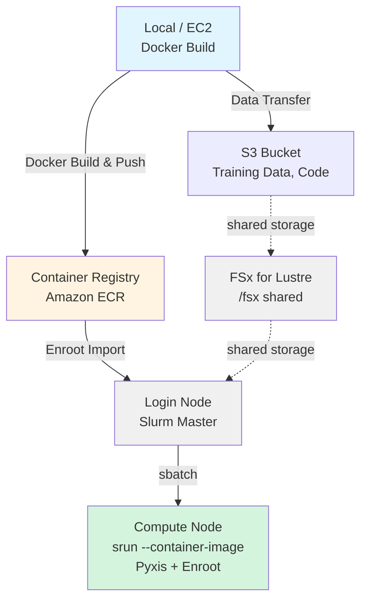

# OpenPI LoRA Training Guide with HyperPod + Slurm + Enroot

AWS SageMaker HyperPod에서 Slurm + Enroot를 사용해 Docker container 안에서 LoRA fine-tuning을 실행하는 가이드입니다.

## Architecture



***

## Prerequisites

1. **HyperPod Cluster**: 이 project에 포함된 CDK로 AWS에 구축한 HyperPod cluster가 필요합니다.
   아래 단계는 CDK로 deploy한 HyperPod cluster를 가정하지만, console에서 수동으로 생성한 cluster도 training에 사용할 수 있습니다.
2. **Development Environment**: 다음 setup이 필요합니다.
   1. AWS credentials configuration: ECR access에 필요합니다.
   2. Docker: pi0 training image build에 필요합니다.
3. **Hugging Face Token**: Sample training dataset download에 필요합니다 (`HF_TOKEN`).
   1. [Hugging Face](https://huggingface.co/settings/tokens)에 sign up하고 token을 미리 생성해야 합니다. 직접 준비한 training data를 사용할 경우 필요하지 않습니다.

***

## Execution Steps

### Local에서 Image Build 및 ECR Push

#### Docker Image Build 및 ECR Push

```bash
cd samples/openpi-sample/

# Clone openpi
git clone https://github.com/Physical-Intelligence/openpi.git

cd lora_training/

# ECR로 build & push (AWS CLI default region 사용)
./build_and_push_ecr.sh

# region과 account ID를 모두 지정
./build_and_push_ecr.sh us-west-2 123456789012

# 특정 tag 지정
IMAGE_TAG=v1.0.0 ./build_and_push_ecr.sh
```

**Environment Information을 가져오는 방식 (Local PC)**:

Script는 다음 priority로 environment information을 가져옵니다.

1. **Command-line arguments** (highest priority)
2. **Environment variables** (`AWS_REGION`, `AWS_ACCOUNT_ID`)
3. **AWS CLI configuration**
   * Region: `aws configure get region`
   * Account ID: `aws sts get-caller-identity --query Account --output text`

**What the script does**:
* ECR repository `openpi-lora-train`을 생성합니다. 이미 있으면 건너뜁니다.
* Docker image를 build합니다. `train_lora.Dockerfile`을 사용합니다.
* ECR에 push합니다.

**Example output**:

```
✅ Docker image successfully pushed to ECR
Image URI: 123456789012.dkr.ecr.us-west-2.amazonaws.com/openpi-lora-train:latest
```

***

### HyperPod Login Node 준비

#### HyperPod SSH Connection

[/hyperpod/docs/ko/DEPLOYMENT.md](/hyperpod/docs/ko/DEPLOYMENT.md)의 SSH connection 안내에 따라 접속합니다.

```
ssh pask-cluster
```

#### Project Setup

```bash
# PASK repository clone
cd
git clone https://github.com/aws-samples/sample-physical-ai-scaffolding-kit.git

# setup 실행. Parameter는 아래 설명 참고
cd samples/openpi-sample/lora_training
./setup.sh --hf-token "hf_xxxxx"

# environment variables 적용
source ~/.bashrc
```

**Parameters**
* hf-token (optional): "hf\_"로 시작하는 Hugging Face token을 지정합니다.
  * [Hugging Face](https://huggingface.co/settings/tokens)에 sign up하고 token을 미리 생성해야 합니다.

**What the script does**

1. OpenPI repository를 clone합니다.
   - /fsx/ubuntu/samples/openpi-sample/openpi/ 가 없을 때 실행됩니다.
   - GitHub에서 git clone <https://github.com/Physical-Intelligence/openpi.git> 를 실행합니다.
2. Directory structure를 생성합니다.
   - /fsx/ubuntu/samples/openpi-sample/logs/
   - /fsx/ubuntu/samples/openpi-sample/.cache/
   - /fsx/ubuntu/samples/openpi-sample/openpi/assets/physical-intelligence/libero/
3. \~/.bashrc에 environment variables를 설정합니다.
   - 기존 OpenPI/Enroot 설정이 있으면 제거하고 backup을 생성합니다.
   - 다음 environment variables를 추가합니다. 이 environment variables는 모든 Slurm job script에서 사용됩니다.
     * export OPENPI\_BASE\_DIR=/fsx/ubuntu/samples/openpi-sample
     * export OPENPI\_PROJECT\_ROOT=\${OPENPI\_BASE\_DIR}/openpi
     * export OPENPI\_DATA\_HOME=\${OPENPI\_BASE\_DIR}/.cache
     * export OPENPI\_LOG\_DIR=\${OPENPI\_BASE\_DIR}/logs
     * export HF\_TOKEN=<value specified as argument or empty>
     * export ENROOT\_CACHE\_PATH=/fsx/enroot
     * export ENROOT\_DATA\_PATH=/fsx/enroot/data

**About Weights & Biases (wandb)**:
* Default scripts는 wandb를 disable합니다 (`--no-wandb-enabled`).
* wandb로 training을 track하려면:
  1. [wandb.ai](https://wandb.ai)에서 account를 생성합니다.
  2. API key를 가져와 `~/.bashrc`에 추가합니다: `export WANDB_API_KEY=your_key_here`
  3. Script에서 `--no-wandb-enabled`를 제거하거나 `--wandb-enabled`로 변경합니다.

---

#### Enroot로 Docker Image Import

```bash
# ECR image를 Enroot format으로 변환
cd samples/openpi-sample/lora_training

# EC2 metadata에서 auto-detect
./hyperpod_import_container.sh

# image tag 지정
./hyperpod_import_container.sh v1.0.0

# region 지정
./hyperpod_import_container.sh latest us-west-2
```

**Environment Information을 가져오는 방식 (HyperPod Cluster)**:

Script는 다음 priority로 environment information을 가져옵니다. HyperPod 안에서 command-line argument나 environment variable을 지정하지 않으면 EC2 instance metadata에서 정보를 가져옵니다.

1. **Command-line arguments** (highest priority)

   ```bash
   ./hyperpod_import_container.sh [IMAGE_TAG] [AWS_REGION] [AWS_ACCOUNT_ID]
   ```

2. **Environment variables**

   ```bash
   export AWS_REGION=us-west-2
   export AWS_ACCOUNT_ID=123456789012
   ./hyperpod_import_container.sh
   ```

3. **Auto-detection**

   * **Region**: EC2 instance metadata (IMDSv2)

     ```bash
     TOKEN=$(curl -X PUT "http://169.254.169.254/latest/api/token" \
       -H "X-aws-ec2-metadata-token-ttl-seconds: 21600" -s)
     curl -H "X-aws-ec2-metadata-token: $TOKEN" -s \
       http://169.254.169.254/latest/meta-data/placement/region
     ```

   * **Account ID**: AWS STS

     ```bash
     aws sts get-caller-identity --query Account --output text
     ```

4. **Fallback**: Region default는 `us-east-1`

**What the script does**:
* ECR에서 Docker image를 pull합니다.
* SquashFS format (`.sqsh`)으로 변환합니다.
* `/fsx/enroot/data/`에 저장합니다.

**Example output**:

```
✅ Container ready for Slurm execution
Container Name: openpi-lora-train+latest.sqsh
```

**Verification**:

```bash
# import된 container 확인
enroot list

# Example output:
# openpi-lora-train+latest.sqsh
```

***

### Slurm Jobs 실행

#### Normalization Statistics 계산 (처음 한 번만)

```bash
cd samples/openpi-sample/lora_training

# Slurm job으로 submit
sbatch ./slurm_compute_norm_stats.sh pi0_libero_low_mem_finetune

# job ID가 반환됩니다. 예: Submitted batch job 1234
```

**Checking progress**:

```bash
# job status 확인
squeue -u ubuntu

# log를 real time으로 monitor
tail -f ${OPENPI_LOG_DIR}/slurm_<JOB_ID>.out

# error log 확인
tail -f ${OPENPI_LOG_DIR}/slurm_<JOB_ID>.err
```

##### Execution Errors

**Hugging Face Quota Error**:
Sample training data를 사용할 때 Hugging Face에서 download 중 다음과 같은 quota error가 발생할 수 있습니다.
이 경우 최소 5분을 기다린 뒤 `./slurm_compute_norm_stats.sh`를 다시 실행하세요.
Download는 중단된 지점부터 resume되므로 두 번째 시도에서는 quota error 없이 완료됩니다.

```
huggingface_hub.errors.HfHubHTTPError: 429 Client Error: Too Many Requests for url: https://huggingface.co/api/datasets/physical-intelligence/
We had to rate limit you, you hit the quota of 1000 api requests per 5 minutes period. Upgrade to a PRO user or Team/Enterprise organization account (https://hf.co/pricing) to get higher limits. See https://huggingface.co/docs/hub/rate-limits
```

***

#### LoRA Fine-Tuning 실행 (GPU Job)

```bash
cd samples/openpi-sample/lora_training

# LoRA training submit
sbatch ./slurm_train_lora.sh pi0_libero_low_mem_finetune my_lora_run

# custom experiment name으로 실행
sbatch ./slurm_train_lora.sh pi0_libero_low_mem_finetune experiment_$(date +%Y%m%d)
```

**Checking progress**:

```bash
# job status 확인
squeue -u ubuntu

# GPU usage 확인 (compute node에서)
srun --jobid=<JOB_ID> nvidia-smi

# log를 real time으로 monitor
tail -f ${OPENPI_LOG_DIR}/train_<JOB_ID>.out

# error log 확인
tail -f ${OPENPI_LOG_DIR}/train_<JOB_ID>.err
```

**Typical logs during training**:

```
[1000/30000] loss=0.234 lr=1e-4 step_time=1.2s
[2000/30000] loss=0.189 lr=9e-5 step_time=1.1s
Saving checkpoint to /fsx/ubuntu/openpi_test/openpi/checkpoints/pi0_libero_low_mem_finetune/my_lora_run/2000
```

**Verifying completion**:

```bash
# job completion status 확인
sacct -j <JOB_ID> --format=JobID,State,ExitCode

# checkpoints 확인
ls -lh ${OPENPI_PROJECT_ROOT}/checkpoints/pi0_libero_low_mem_finetune/my_lora_run/

# Example output:
# drwxr-xr-x  1000/
# drwxr-xr-x  2000/
# drwxr-xr-x  5000/
# drwxr-xr-x  30000/  <- Final checkpoint
```

***

## Slurm Job Management Commands

### Checking Jobs

```bash
# 본인 job 목록
squeue -u ubuntu

# 상세 정보
squeue -u ubuntu -o "%.18i %.9P %.30j %.8u %.2t %.10M %.6D %R"

# 모든 job (entire cluster)
squeue
```

### Canceling Jobs

```bash
# 특정 job cancel
scancel <JOB_ID>

# 본인 job 전체 cancel
scancel -u ubuntu

# name으로 job cancel
scancel --name=openpi_lora_train
```

***

## Reference Resources

### Documentation

* [AWS HyperPod Documentation](https://docs.aws.amazon.com/sagemaker/latest/dg/sagemaker-hyperpod.html)
* [Enroot Documentation](https://github.com/NVIDIA/enroot)
* [Slurm Documentation](https://slurm.schedmd.com/documentation.html)
